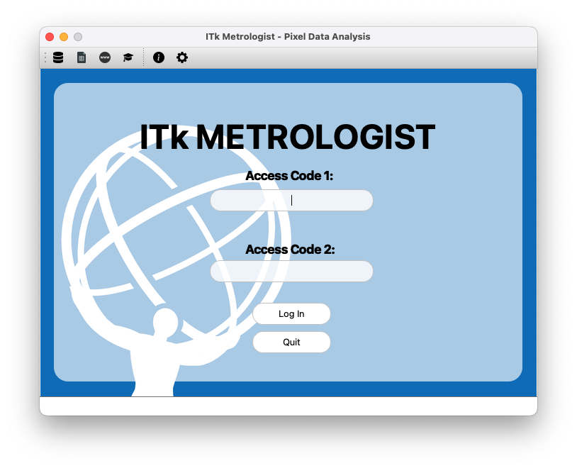
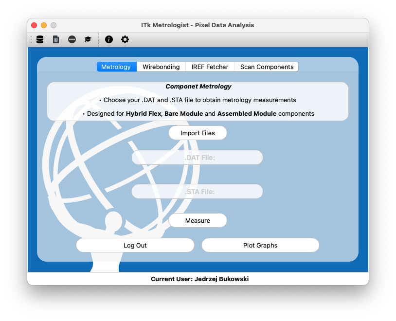
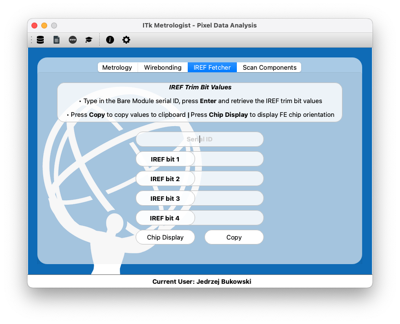

# ITk Metrologist
Program designed for processing and analysing data associated with core pixel module assembly as part of the ATLAS ITk project.

## Details
  
  
  
  

## Table of Contents
- [Installation](#installation)
- [Usage](#usage)
- [Features](#features)
- [Acknowledgments](#acknowledgments)
- [License](#license) 

## Installation
1. Open the terminal and locate the directory where you would like to clone the repository
   ```
   $ git clone https://github.com/4ndybuk/ITk-Metrologist
   ```
3. Install dependancies with
   ```
   $ python install_packages.py
   ```
5. Request credentials.json or utilise your own Google Sheets credentials file which needs to be placed in the **assets** folder
4. Run the program with
   ```
   python main.py
   ```

## Usage
1. The program requires an existing account to the ITk Production Database, use both passwords to login
2. To make the login process easier, Open the ⚙️  in the toolbar, store your passwords in the file and save it
3. Have your bluetooth QR/barcode connected to the device to be used for the "Scan Components" feature

## Features
1. Processing .STA and .DAT metrology files and uploading the extracted data to the ATLAS production database or custom Google Sheet
2. 3D plots for visualising each pixel component in pre-processed and processed form in order to spot inconsistencies
3. Processing and uploading Wirebonding data to the production database
4. Retrireving IREF trim bit values from Bare Modules and graphically displaying FE chips orientation prior to assembly
5. Custom table for more efficient component organsiation which works with barcode scanners or manual inputs
6. Dockable toolbar with links to useful sites directly related to the project

## Images
    

## Acknowledgments
1. Thanks to Pixel perfect, zafdesign, Freepik and Stockio from www.flaticon.com for Icons
2. GUI designed using QT Framework for Python - PySide6
3. Program powered by itkdb - ITk Production Database API wrapper
4. Graphical plots by Plotly - www.plotly.com

## License
1. This project is licensed under the Non-Commercial License - see the [LICENSE](LICENSE) file for details.
